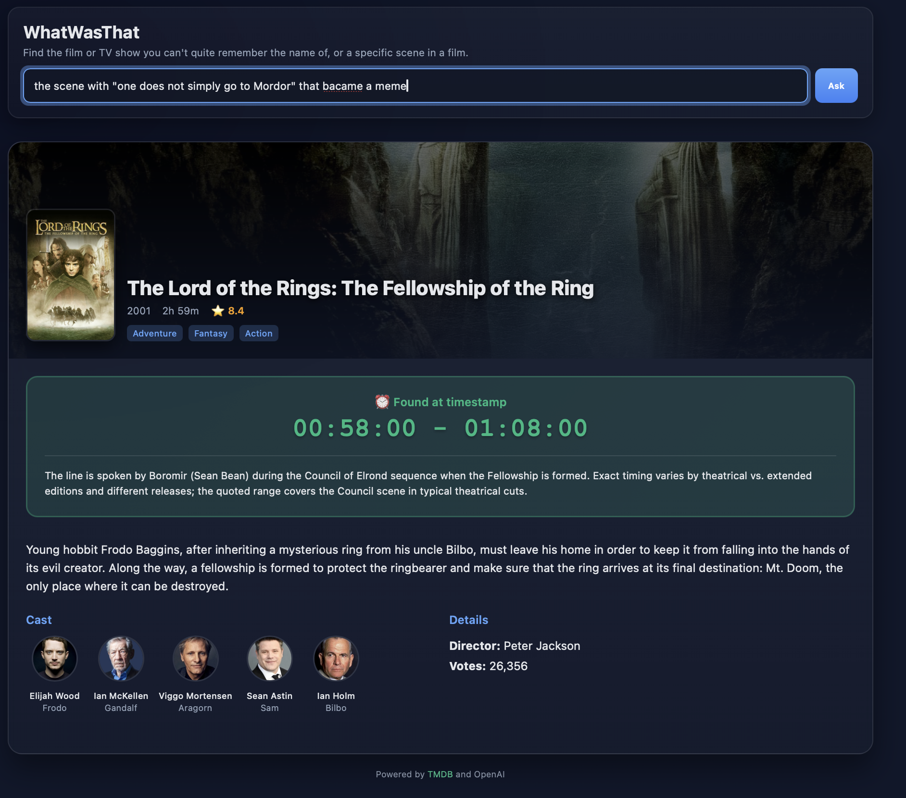

# WhatWasThat

A beautiful web application that helps you identify movies and TV shows from descriptions, powered by OpenAI and enhanced with rich metadata from TMDB.

## Features

- 🎬 **Smart Content Recognition**: Describe a scene and get accurate movie/TV show identification
- 🖼️ **Rich Visual Experience**: Beautiful cards with posters, backdrops, and cast photos
- ⏰ **Timestamp Detection**: Find specific moments within episodes or movies
- 📺 **Comprehensive Details**: Ratings, cast, crew, genres, and plot summaries
- 📱 **Responsive Design**: Works perfectly on desktop and mobile



## Setup

### 1. Get an OpenAI API Key

1. Sign in to the [OpenAI dashboard](https://platform.openai.com/)
2. Create an API key (or retrieve an existing one)
3. Copy the key — you'll add it to your environment shortly

If you're using Azure OpenAI or a proxy endpoint, also note the base URL and model deployment name you'll need to target.

### 2. Get a TMDB API Key

1. Go to [TMDB](https://www.themoviedb.org/)
2. Create a free account
3. Navigate to Settings → API
4. Request an API Key (choose "Developer")
5. Copy your API key

### 3. Configure Environment

Create a `.env` file in the project root:

```bash
OPENAI_API_KEY=your_openai_api_key_here
# Optional: set if you're using Azure OpenAI or a proxy endpoint
OPENAI_BASE_URL=https://api.openai.com/v1
# Optional: override the default model (defaults to gpt-4o-mini)
OPENAI_MODEL=gpt-4o-mini
TMDB_API_KEY=your_tmdb_api_key_here
PORT=3000
```

If you're using the default OpenAI API (`api.openai.com`), you can remove `OPENAI_BASE_URL` or leave it empty. The `OPENAI_MODEL` variable lets you pick a preferred model; omit it to fall back to the default.

### 4. Install and Run

```bash
npm install
npm run dev
```

Visit `http://localhost:3000` and start asking about your favorite movies and shows!

## Examples

Try asking:

**Content Identification:**
- "Which South Park episode has them playing with toilet rolls?"
- "What's the movie where Tom Hanks is stuck on an island?"

**Scene-Specific Queries (automatically includes timestamps):**
- "The scene where they're in a diner talking about tipping in Pulp Fiction"
- "The part where Walter throws pizza on the roof in Breaking Bad"
- "The scene where Harry kills the snake in the second Potter film"
- "The moment when Neo dodges bullets in The Matrix"

**Explicit Timestamp Requests:**
- "When does Neo die in The Matrix?"
- "At what point do they talk about royales with cheese?"

## Deployment

### Vercel Deployment

This app is configured for easy deployment on Vercel:

1. **Install Vercel CLI** (optional):
   ```bash
   npm i -g vercel
   ```

2. **Deploy**:
   ```bash
   vercel --prod
   ```
   Or connect your GitHub repo to Vercel for automatic deployments.

3. **Set Environment Variables** in Vercel dashboard:
   - `OPENAI_API_KEY`: Your OpenAI API key
   - `OPENAI_BASE_URL`: Your OpenAI endpoint (if using Azure)
   - `OPENAI_MODEL`: Your preferred model (e.g., gpt-4o-mini)
   - `TMDB_API_KEY`: Your TMDB API key
   - `NODE_ENV`: production

### Local Development

```bash
npm install
npm run dev
```

## API

The application provides API endpoints:

- **POST `/api/ask`**: Main content identification endpoint
- **GET `/api/health`**: Health check endpoint

```json
{
  "question": "Your movie/TV question here"
}
```

Response includes both OpenAI identification and rich TMDB metadata with images, cast, ratings, and detailed information.

## Architecture

- **Frontend**: Modern HTML/CSS/JS with beautiful responsive design
- **Backend**: Express.js server with OpenAI integration
- **Data Sources**: 
  - OpenAI GPT for content identification
  - TMDB API for rich metadata, images, and cast information
- **Features**: Real-time search, loading states, error handling, and mobile-friendly UI
